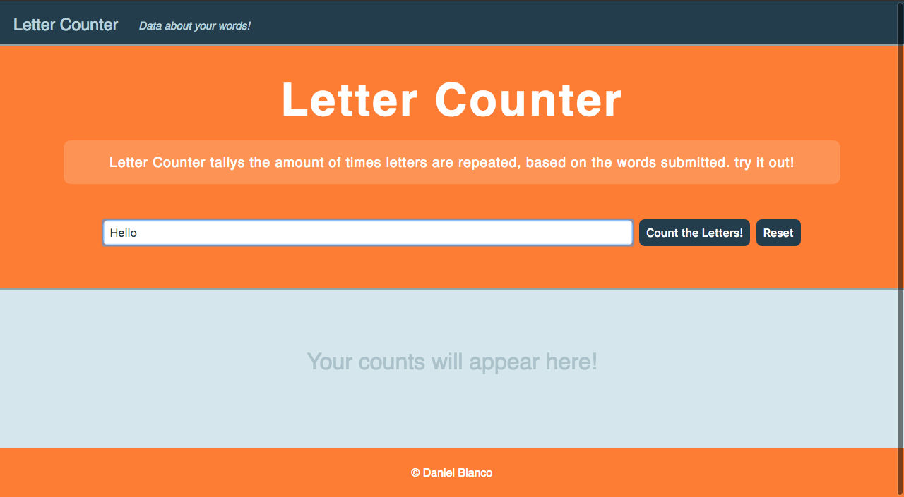
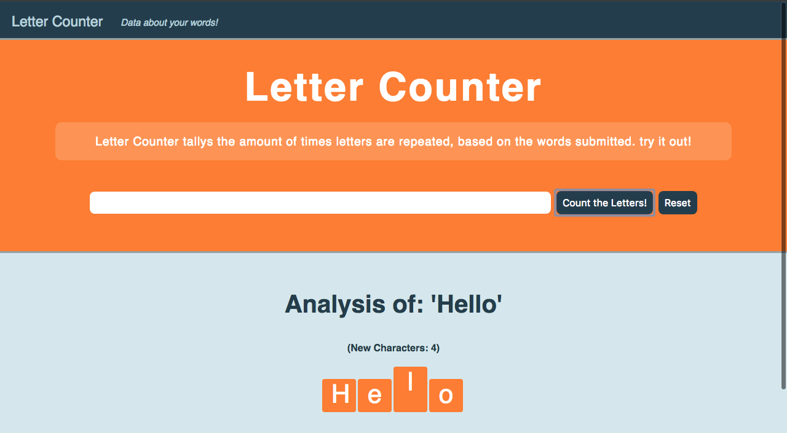
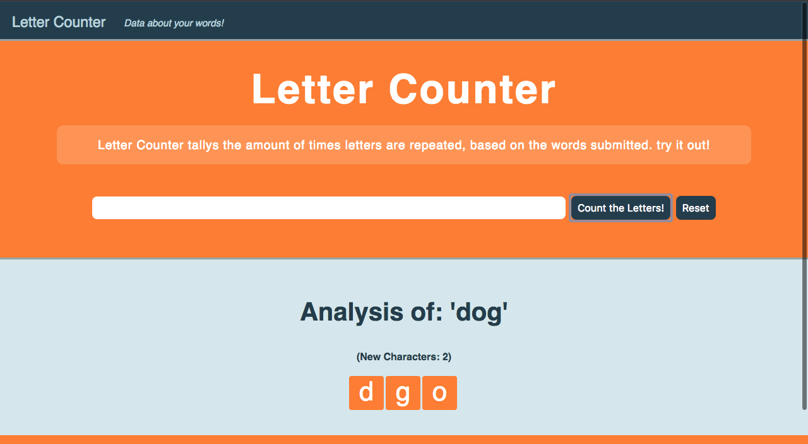

# Letter Counter

a Javascript web app that counts your letters!

## Technologies used:

- HTML5
- CSS3
- Javascript
- Node JS
- D3 JS
- SVGs

## NPM Packages used:

- express
- nodemon

## Version

1.0

## Usage

#### First the user enters a word.

#### When the user submits, a graph will appear with the letters used, and how frequently they are used. the amount of new characters is listed above the graph.

#### When the user submits the second word, a new graph will appear with data about the new word. the web app keeps the previous words in memory, and tells you how many letters in the current word are new. this can be reset with the reset button.

### Link to the live site

https://letter-counter.herokuapp.com/
